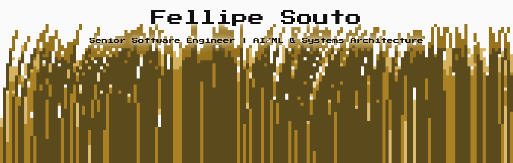

<picture>
  <source media="(prefers-color-scheme: dark)" srcset="assets/banner-dark.gif">
  
</picture>

   

### About

Nearly 14 years delivering production software across AI/ML, fintech, logistics, legal technology, SaaS and enterprise data platforms. I combine hands-on Python and Java with agentic AI, RAG and systems architecture, and I have spent years teaching what I build, from Caelum classrooms to university lectures at FIAP. Currently Senior Software Engineer / ML Engineer at Data Meaning, through my consultancy [Binary Forge IT](https://github.com/binary-forge-it).

### Tech stack

| Area | Stack |
|---|---|
| **Languages** |        |
| **AI & Retrieval** |         |
| **Web & Backend** |         |
| **Cloud & Platform** |        |
| **Data** |      |
| **Practices & Methodologies** | Agile · DDD · Clean Code & Architecture · TDD/BDD |

### Selected impact

- **Data-quality platform for a US Fortune 500 retailer**: full-stack lead and architect; thousands of rules scanning millions of records several times daily through Databricks, used by 30+ BI professionals.
- **Route optimisation at Zé Delivery**: combinatorial and heuristic order batching on AWS Lambda that grouped 97% of orders, scaling from 1 to 82 dark stores as annual orders grew from ~200k to 4M.
- **Agentic RAG MVP**: designed and built end to end with React, FastAPI, LangGraph, LangChain, Claude SDK and Azure AI Search, with CI/CD and container-native deployment on AKS.

### Career

| Period | Role | Company |
|---|---|---|
| 2024 – now | Senior Software Engineer / ML Engineer | Data Meaning (via Binary Forge IT) |
| 2023 | Senior Software Engineering Consultant | Campspot |
| 2022 – 2023 | Staff Software Engineer (Squad Lead) | Zup Innovation |
| 2022 | Senior Software Developer, Platform Engineer | Vinta Software |
| 2020 – 2022 | Software Engineer | Zé Delivery |
| 2019 – 2020 | Technical Instructor | Caelum |
| 2017 – 2019 | Full-Stack Software Engineer | Alura |
| 2016 – 2017 | Software Engineer | Avenue Code |
| 2013 – 2016 | Software Engineering Intern | Medicinia · Nextar · FLOSS Competence Center (USP) |

Stack per role

| Period | Company | Stack |
|---|---|---|
| 2024 – now | Data Meaning (via Binary Forge IT) |                     |
| 2023 | Campspot |              |
| 2022 – 2023 | Zup Innovation |              |
| 2022 | Vinta Software |      |
| 2020 – 2022 | Zé Delivery |      |
| 2019 – 2020 | Caelum |     |
| 2017 – 2019 | Alura |     |
| 2016 – 2017 | Avenue Code |    |
| 2013 – 2016 | Medicinia · Nextar · FLOSS Competence Center (USP) |     |

### Open source

- **[Purple Authorizer](https://github.com/binary-forge-it/purple-authorizer)**: Ranks the vertices of a social graph by closeness centrality, serves the ranking through a REST API, and propagates fraud penalties that decay with graph distance.
- **[Dining Philosophers: Actor Model](https://github.com/fllsouto/dining_philosophers_actor_model)**: A study of concurrency through the Actor Model: Akka actors competing for shared resources in the classic Dining Philosophers problem.

### Teaching

Trained 100+ students at Caelum, produced content for Alura and taught DDD with Java at FIAP.

Courses and free material

| Course | School | Tech | Repositories |
|---|---|---|---|
| Domain-Driven Design with Java (2024) | FIAP |  | [2espw-2024-dddjava](https://github.com/fllsouto/2espw-2024-dddjava) · [2espx-2024-dddjava](https://github.com/fllsouto/2espx-2024-dddjava) · [check_point_fiap_esp_wx_s2_2024](https://github.com/fllsouto/check_point_fiap_esp_wx_s2_2024) · `global_solution_fiap_esp_wx_s2_2024` |
| FJ-21 | Caelum |  | `fj21-tarefas` · `fj21-agenda` · `fj21-jdbc` · `fj21-custom-jd` |
| FJ-22: Desenvolvendo na prática com Spring e testes | Caelum |   | `fj22` · `fj22-custom-jd` |
| FJ-27: Spring Framework | Caelum |  | `fj27` · `fj27-custom-jd` |
| FJ-33 (Spring Cloud Config) | Caelum |  | `fj33-config-server-repo` |
| DO-26: Infraestrutura ágil com Docker e Docker Swarm | Caelum |  | `do26` |
| PY-14: Python e Orientação a Objeto | Caelum |  | `py14` |
| JS-46 (React & Redux) | Caelum |   | `js46-react-redux` |

### Work with me

Through Binary Forge IT I offer: Training & workshops for teams · private teaching · IT career coaching. Write to [f.souto@outlook.com](mailto:f.souto@outlook.com).

**Full story, stack per role, projects and course material → [fllsouto.github.io](https://fllsouto.github.io)**

🇧🇷 Versão em português

**Engenheiro de Software Sênior | IA/ML e Arquitetura de Sistemas**

Quase 14 anos entregando software em produção em IA/ML, fintech, logística, legal tech, SaaS e plataformas de dados corporativas. Fundador da Binary Forge IT, por onde atendo clientes internacionais. Fui instrutor técnico na Caelum (100+ alunos), produtor de conteúdo na Alura e professor de DDD com Java na FIAP.

Ofereço treinamentos e workshops para equipes, aulas particulares e mentoria de carreira em TI: [f.souto@outlook.com](mailto:f.souto@outlook.com)

